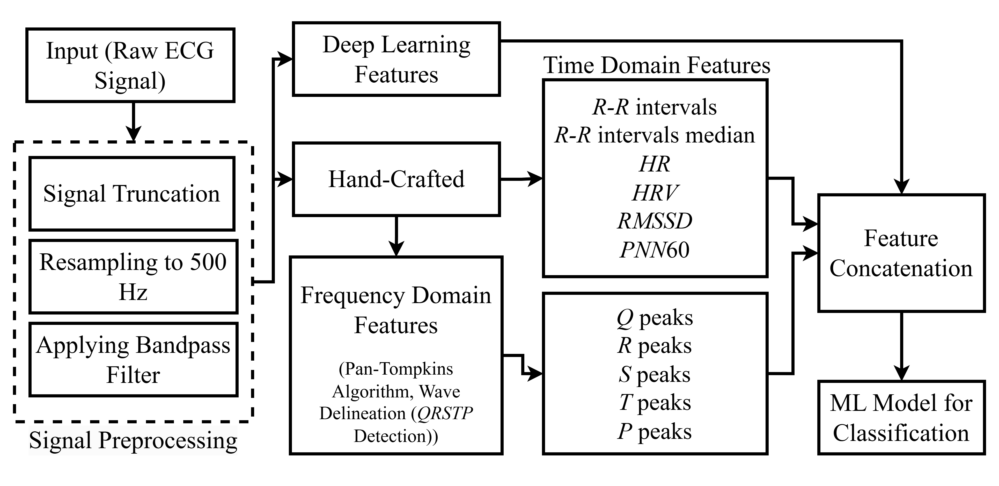
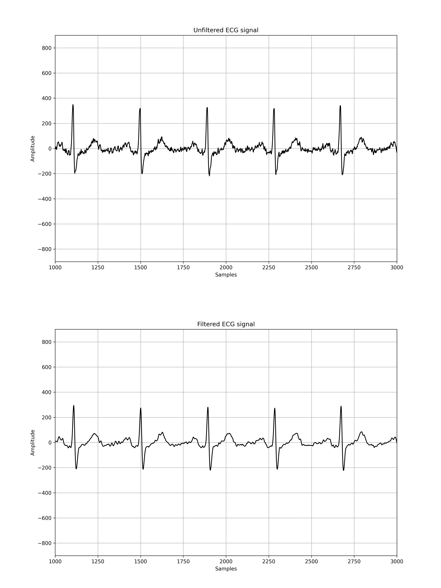
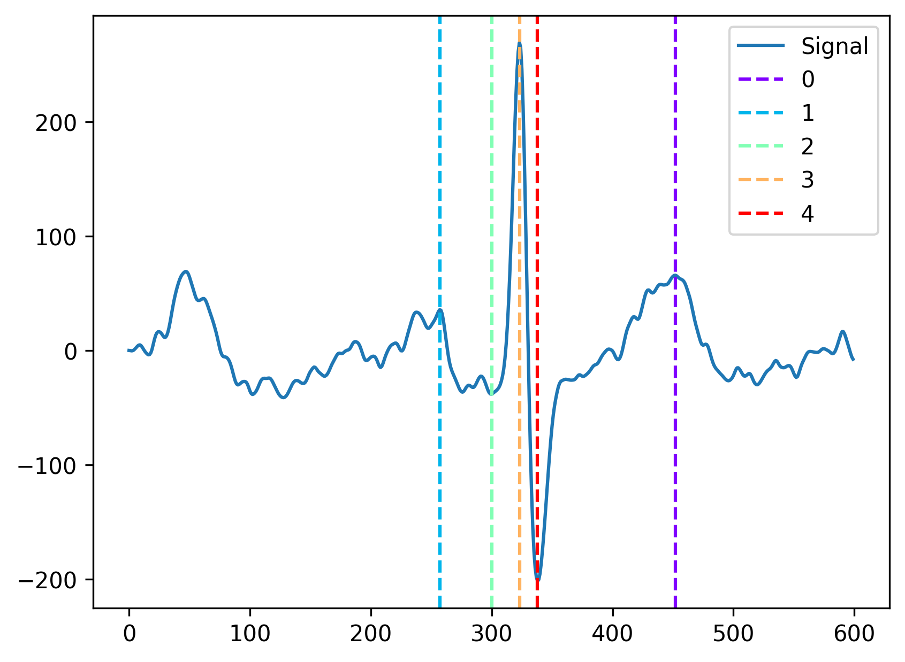

# Hybrid Feature Extraction for 12-Lead ECG Classification by Integrating Handcrafted and Deep Learning Techniques

## Workflow overview

The [dataset](//physionet.org/content/challenge-2020/1.0.2/) is available on Physionet 2020 Cardiology Challenge page

Depenencies

* Scipy.io
* neurokit2
* tqdm
* Pytorch

## Signal preprocessing
### Selecting the data
Since there are 112 classes originally we will only be working with 7 classes. For that we need to select specific ECG signals according to the labels provided in .hea files. 
Open select_data_loader.ipynb , load the selected data into a dictionary and save the selected data into .../Selected_data on your PC.

### Resampling the data
The ECG signals in the provided dataset come in 3 different frequencies: 1000hz, 500hz, and 275hz. st_petersbur_incart comes in 275/273hz frequency, because the dataset was discarded earlier we do not need to worry about it. The rest of the datasets come in 500hz frequency except for PTB and PTB-XL which come in 1000hz frequency.  So the next step will be down sampling this dataset to 500hz.

Open data_resampling.ipynb. To keep the code less complicated we can just resample both datasets one by one and store them in the folder called Resampled_data.
After that let's move the previously selected datasets from ../Selected_data to ../Resampled_data except for ptb and ptb-xl. 

NOTE: After that Resampled_data folder will contain all the 5 folders with different datasets (ptb and ptb-xl were down sampled, and the rest of the datasets remain unchanged)

### Reshaping the data
Reshaping the data involves giving all the ECG signals a uniform length. We will cut the signal at the end if it's longer than 10 seconds, and pad it with zeros if it's shorter than 10 seconds.
Open data_reshaping_lengh.ipynb This file will load the data from a directory on your PC (Resampled_data) and save it into a new directory called Reshaped_data.

### Applying Bandpass filter
Applying Bandpass Filter will get rid of the noise and unwanted frequencies this will result in more smooth signal which is important. 

Open bandpass_filter.ipnb, load the data from ../Reshaped_data using the data_loader_mat.py. After the filter is applied and the filtered signals are stored in a dictionary we can 
save them to a directory. Use data_saver.py to save the filtered data to ../Filtered_data

## Data labeling
Open labeling_numeric_classes.ipynb. As the main directory path use ../Selected_data because it contains .hea files which will tell us what label to assign to each ECG signal.
After that the labels will be saved in a .csv file on your PC.

## Hand-crafted features extraction
First we will have to clean the dataset and remove the corrupted signals that can't be used in feature extraction. Run remove_files.py and Removing_NaN_signals.py respectively. 
After it is done we can proceed with QRSTP peaks extraction from the signal. Features_extraction_QRSTP.py will extract the frequency doemain features and store them in a .json file.

Afterwards, we can proceed with the time domain features extraction throught the Feature_extractions_RR_interval_time_domain.py. Earlier exractred R-peaks will be used for that. 

## Deep learning features extractions
We use a simple CNN (cnn_features_extraction_and_validation.py) and a modified ResNet 18 model (resnet_features_extractions.py) for 1 dimentional imput. Both model will separate extracted features. Feel  free to use both models to compare their impact on the final classification. 
You can utilize a different model or develop your own as well. The features will be stored in a .csv file.

## Final classification
Here we have 3 different approaches for the final training and classification:
1. Utilize only hand-crafted features
2. Utilize only deep learning features
3. Combine hand-crafted features and deep learning features.

Since the third option is the most optimal and will produce the best results we will proceed with that.
resnet_classification.py will concatanate hand-crafted and deep learning features. A simple neural network will be used for the final training and classification.

